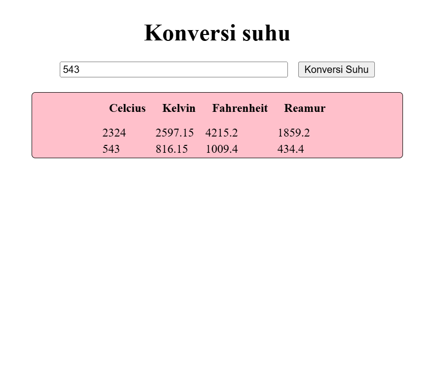

# Konversi Suhu (DOM JavaScript)

Project sederhana untuk mempelajari **DOM Manipulation** dengan JavaScript.  
Aplikasi ini menampilkan daftar suhu dalam Celcius, lalu bisa dikonversi ke **Fahrenheit, Reamur, dan Kelvin** menggunakan tombol.

## Fitur

- input yang bisa mengonversi dari celcius ke reamur dan fahrenheit

## Teknologi

- HTML
- CSS
- JavaScript (DOM)

